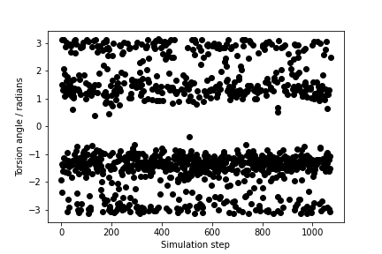

# PLUMED Masterclass 21.6: Dimensionality reduction

## Aims

The primary aim of this Masterclass is to show you how you might use PLUMED in your work.
We will see how to call PLUMED from a python notebook and discuss some strategies for selecting
collective variables.

## Objectives

Once this section is completed, users will be able to:

- Calculate CVs and import them into a python notebook.
- Generate visualizations of data using chemiscope

## Acknowledgements

Throughout this exercise, we use the [atomistic simulation environment](https://wiki.fysik.dtu.dk/ase/) 
and [chemiscope](https://chemiscope.org/).  Please look at the information at the links I have provided here 
for more information about these codes.

## Setting up the software 

For this Masterclass, you will need to set up the plumed and gromacs as you did for [this masterclass](https://www.plumed.org/doc-v2.8/user-doc/html/masterclass-21-1.html).  You thus install plumed and gromacs using:

````
conda install --strict-channel-priority -c plumed/label/masterclass-mpi -c conda-forge plumed
conda install --strict-channel-priority -c plumed/label/masterclass-mpi -c conda-forge gromacs
````

You can install the other software you need using:

````
conda install -c conda-forge py-plumed Numpy pandas matplotlib notebook mdtraj mdanalysis git ase
````

Notice that you need a package called ase (the atomic simulation environment) for these exercises and the other packages you have been using.
You also need to install chemiscope, which you can do by using the following command:

````
pip install chemiscope
````

## Resources

The data needed to complete this Masterclass can be found on [GitHub](https://github.com/plumed/masterclass-21-6).
You can clone this repository locally on your machine using the following command:

````
git clone https://github.com/plumed/masterclass-21-6.git
````

I recommend that you run each exercise in a separate sub-directory (i.e. Exercise-1, Exercise-2, ...), which you can create inside the root directory `masterclass-21-6`. Organizing your data this way will help you to keep things clean.

_All the exercises have been tested with PLUMED version 2.7.0._

## Exercises

### Exercise 1: Running PLUMED from a python notebook

I like working with Python notebooks.  Using notebooks allows me to keep the codes that I am working on close to the explanations of how these codes work.
I can also make all my figures within a notebook.  By using notebooks, I can thus have a single file that contains:

- Discussion of the work done.
- The analysis code.
- The final figures that were generated.

In previous masterclasses we have run plumed driver through bash from within a notebook by using commands like the one shown below:

```python
!cd ../Exercises/Exercise_1 && plumed driver --noatoms > /dev/null
# Read in colvar file produced
data = np.loadtxt("../Exercises/Exercise_1/colvar")
```

We have then read in the colvar file produced and analyzed it from within the notebook.  We can avoid using plumed driver and can call 
plumed directly from python using the python interface.  The code below, for instance, generates the plot underneath the 
code.  The code reads in the trajectory from the file traj.pdb that you obtained from the GitHub repository.  The plot then shows how 
the $\phi$ angle on the second residue of the protein changes with time.     
 
```python
import matplotlib.pyplot as plt
import numpy as np
import plumed
import ase 
import ase.io 

# Read in trajectory using ase
traj = ase.io.read('../data/traj.pdb',':')

# Setup plumed object to do calculation
p = plumed.Plumed()
p.cmd("setMDEngine","python")
# Read PDB so need to multiply by 0.1 to convert to nm
p.cmd("setMDLengthUnits", 0.1)
p.cmd("setTimestep", 1.)
p.cmd("setKbT", 1.)
natoms = len(traj[0].positions)
p.cmd("setNatoms",natoms)
p.cmd("setLogFile","test.log")
p.cmd("init")

# Read plumed input 
p.cmd("readInputLine","MOLINFO STRUCTURE=../data/bhp.pdb")
# If you are doing many variables I would represent putting these 
# next three PLUMED commands into a function
p.cmd("readInputLine", "t1: TORSION ATOMS=@phi-2" )
# Now setup some memory to hold the variable that is shared 
# between plumed and the underlying code
shape = np.zeros( 1, dtype=np.int_ )
p.cmd("getDataRank t1 ", shape )
t1 = np.zeros((1))
p.cmd("setMemoryForData t1", t1)

# Loop over trajectory and get data from plumed
nfram, tt, v1, box = 0, [], [], np.array([[100.,0,0],[0,100.,0],[0,0,100]])
charges, forces, virial = np.zeros(natoms,dtype=np.float64), np.zeros([natoms,3]), np.zeros((3,3),dtype=np.float64)
for ts in traj : 
    # Set all the input variables to PLUMED
    p.cmd("setStep",nfram)
    p.cmd("setBox",box )
    p.cmd("setMasses", ts.get_masses() )
    p.cmd("setCharges", charges )
    pos = np.array(ts.get_positions(), dtype=np.float64 )
    p.cmd("setPositions", pos )
    p.cmd("setForces", forces )
    p.cmd("setVirial", virial )
    # Run the plumed calculation
    p.cmd("calc")
    tt.append(nfram)
    # We can now extract the value of the torsion by accessing the shared memory we set up earlier
    v1.append(t1[0])
    nfram = nfram + 1

# Plot teh graph of the torsional angle as a function of time
plt.plot( tt, v1, 'ko')
plt.xlabel("Simulation step")
plt.ylabel("Torsion angle / radians")
plt.show()
```



__Your task in this first exercise is to modify the code above and to produce a figure similar to the one shown below.__  This figure 
shows all the values of the $\phi$ and $\psi$ angles in the second residue of the protein during the simulation.


### Exercise 2: Generating a chemiscope representation

Plots showing the trajectory in CV space similar to those you generated at the end of the previous exercise are helpful.  What would be more 
useful, however, is some way of understanding the relationship between the positions in CV space and the structures of the various atoms.
In other words, what we would like is something like this:


You can see the frame in the trajectory that each point in the plot corresponds to from the above figure.  The snapshots on the right correspond to the structures the system
had at the points highlighted in red, yellow, green and blue respectively in the plot on the left.  

The figure above was generated using chemiscope. This server allows you to generate and interact with plots like the one shown above.  __Your task in this exercise is to generate your own chemiscope representation
of the data in traj.pdb.__  To create a chemiscope representation of the $\phi$ angles that we generated using the first python script from the previous exercise, you would 
add the following python code:

```python
from ase.data import atomic_masses
from chemiscope import write_input

# This ensures that the atomic masses are used in place of the symbols
# when constructing the atomic configurations' chemiscope representations.
# Using the symbols will not work because ase is written by chemists and not 
# biologists.  For a chemist, HG1 is mercury as opposed to the first hydrogen
# on a guanine residue.  
for frame in traj:
    frame.numbers = np.array(
        [
            np.argmin(np.subtract(atomic_masses, float(am)) ** 2)
            for am in frame.arrays["occupancy"]
        ]
    )

# This constructs the dictionary of properties for chemiscope
properties = {
    "time": {
        "target": "structure",
        "values": tt,
        "description": "Simulation step number",
    },
    "t2": {
        "target": "structure",
        "values": v1,
        "description": "Phi angle of second residue",
    },
}

# This generates our chemiscope output
write_input("torsion_chemiscope.json.gz", frames=traj, properties=properties )
```

You would then upload the `torsion_chemiscope.json.gz` file that is generated by this script at [https://chemiscope.org](https://chemiscope.org).

__See if you can generate your own chemiscope representation of the data in traj.pdb.__ I would recommend calculating and uploading a chemiscope representation of all the protein's torsional angles. At the very least, you need to do at least two backbone torsional angles.  However, if you do more than two torsions, you can generate a plot like the one shown below.


## Summary

You can do your analsysis by running PLUMED from python directly.  Similarly you can hopefully think of ways to use chemiscope to visualise your own trajectories.  We will use these techniques in the exercises that follow but hopefully you can already see that they will be useful for your own research.  
