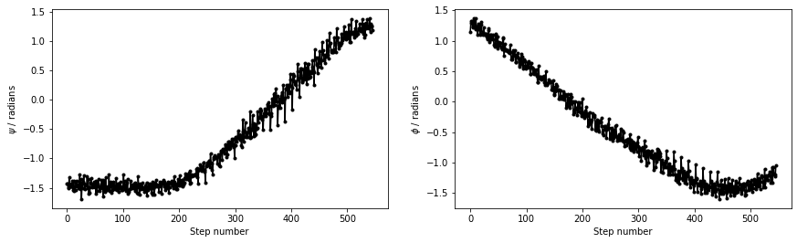

# PLUMED Masterclass 21.6: Dimensionality reduction

## Aims

The primary aim of this Masterclass is to show you how you might use PLUMED in your work.
We will see how to call PLUMED from a python notebook and discuss some strategies for selecting
collective variables.

## Objectives

Once this Masterclass is completed, users will be able to:

- Use the projection of a vector as a CV.
- Use path collective variables.

## Resources

The data needed to complete this Masterclass can be found on [GitHub](https://github.com/plumed/masterclass-21-6).
You can clone this repository locally on your machine using the following command:

````
git clone https://github.com/plumed/masterclass-21-6.git
````

I recommend that you run each exercise in a separate sub-directory (i.e. Exercise-1, Exercise-2, ...), which you can create inside the root directory `masterclass-21-6`. Organizing your data this way will help you to keep things clean.

_All the exercises have been tested with PLUMED version 2.7.0._

## Acknowledgements

Throughout this exercise, we use the [atomistic simulation environment](https://wiki.fysik.dtu.dk/ase/) 
and [chemiscope](https://chemiscope.org/).  Please look at the information at the links I have provided here 
for more information about these codes.

## Exercises

In many papers in this area, you will hear people talk about the distinction between collective variables and the reaction coordinate.  The distinction these authors are trying emphasize when they use this language 
is between a descriptor that takes different values for the various important basins in the energy landscape (the collective variable) and the actual pathway the reaction proceeds along (the reaction coordinate).
Furthermore, the authors of such papers will often argue that the reaction coordinate is simply some linear/non-linear combination of collective variables.
In this exercise, we will study alanine dipeptide with path collective variables to show you one way of thinking about this distinction between collective variables and reaction coordinates.  
By studying a system that is this simple, you will also hopefully come to understand how we can interpret the coordinates that we extract using the dimensionality reduction algorithms that were discussed in the previous exercise.

To remind you, the free energy surface as a function of the $\phi$ and $\psi$ angles for alanine dipeptide is shown below:


In other masterclasses, we have discussed how there are two critical states in the above energy landscape.  These states are labelled C7eq and C7ax above.  The two Ramachandran angles plotted on the x and y axes of the free energy surface
above are examples of what we have called collective variables.  Both of these angles can be used to distinguish between C7eq and C7ax configurations.
The reaction coordinate is the path that the system actually takes as it moves from the C7ax to the C7eq configuration.  Based on the shape of the free
energy surface, we might suppose that this reaction  coordinate looks something like the black line shown below: 

 

The file called alanine-transformation.pdb that you can find in the data directory of the GitHub repository contains a series of configurations that lie close to the transition path that is illustrated in black in the figure above.  Below are plots that show how 
$\phi$ and $\psi$ change as the system moves along this path.  __Try to see if you can use what you have learned in previous masterclasses to reproduce the figure above before continuing.__  



### RMSD distances

We know what structures correspond to the various stable states of our system.  We might, therefore, be tempted to ask ourselves if we can not just use the RMSD distance from a structure as the reaction coordinate.
This approach will work if there is a single important configuration in the energy landscape.  We could use the RMSD distance from this lowest energy structure as a CV to extract this configuration's free energy
relative to everything else.  How well does this work if we have two distinct states, though, as we have for alanine dipeptide?  To investigate this question, fill in the PLUMED input below that calculates the RMSD distances 
from the C7ax and C7eq configurations:

```plumed
#SOLUTIONFILE=work/plumed_ex5.dat
c7ax: RMSD __FILL__=../data/c7ax.pdb TYPE=__FILL__ 
c7eq: RMSD __FILL__=../data/c7eq.pdb TYPE=__FILL__
PRINT ARG=c7ax,c7eq FILE=colvar STRIDE=100
```

You can run an MD simulation to monitor these distances using the python script below.

```python
def generate_gromacs_input( directory, plumed_input, nsteps, temp ) :
    # Setup the initial configuration by picking a frame at random from the startpoints file
    allc = io.read('../data/startpoints.pdb',':')
    nframes = len(allc)
    io.write( directory + '/conf.pdb', allc[int(np.random.randint(0,nframes))] )
    # Copy the topology to the appropriate directory
    shutil.copyfile("../data/topol.top", directory + "/topol.top")
    # Setup the mdp file
    mdp = open("../data/md.mdp","r")
    contents = mdp.read()
    mdp.close()
    new_content = contents.replace("SEED", str(np.random.randint(0,1000000))).replace("NSTEPS",str(nsteps)).replace("TEMP",str(temp))
    mdpout = open(directory + "/md.mdp", "w")
    mdpout.write(new_content)
    mdpout.close()
    # And write the plumed input
    pout = open(directory + "/plumed.dat", "w")
    pout.write( plumed_input )
    pout.close()
    return

plm = '''
INSERT PLUMED INNPUT HERE
'''
# Create a directory to run the calculation in
!rm -rf ../Unbiased_MD && mkdir ../Unbiased_MD
# Generate gromacs input for MD simulation at 1000 K
generate_gromacs_input( '../Unbiased_MD', plm, 500000, 1000 )
# Now run gromacs
!cd ../Unbiased_MD/ && gmx_mpi grompp -f md.mdp -c conf.pdb -p topol.top -maxwarn 2 &> /dev/null
!cd ../Unbiased_MD/ && gmx_mpi mdrun --plumed plumed.dat &> /dev/null
# And read in the colvar files
unbiased_data = np.loadtxt('../Unbiased_MD/colvar')
```

I ran simulations at 300K and 1000K using the above script.  When the simulations completed, I was able to construct the figures below:


The black points above are the RMSD values for the trajectories.  I have also shown the RMSD values for the frames in
alanine-transformation in red.  Notice that all the configurations explored in the MD are very distant from the C7ax and C7eq states.
__Try now to reproduce the above figure yourself.__

You can see that at 300K, the simulation we ran did not visit the C7eq state.  Furthermore, you can also clearly see this from the 
projections of the trajectories on the RMSD distances from these two configurations.  Notice in these figures, however, that the distances
from these two reference configurations were often considerably larger than the distance between these reference configurations and the configurations on the reference path in alanine-transformation.pdb.

### Using dot products to calculate CVs

Instead of calculating two distances, we might ask ourselves if the linear combination of $\phi$ and $\psi$ that is illustrated in the figure below:


gives a better description for the transition.  We can define this CV as follows:

$$
s = \frac{(\phi_2 - \phi_1).(\phi_3 - \phi_1) + (\psi_2 - \psi_1).(\psi_3 - \psi_1)}{ \sqrt{(\phi_2 - \phi_1)^2 + (\psi_2 - \psi_1)^2} }
$$

In this expression $(\phi_1,\psi_1)$ are the Ramachandran angles in the $C_7eq$ configuration and 
$(\phi_2,\psi_2)$ are the Ramachandran angles in the $C_7ax$.  $(\phi_3,\psi_3)$ is the 
instantaneous configuration.  You should thus be able to see that we have arrived at the above expression
by using our knowledge of the dot product between two vectors.

__See if you can write an input to re-analyse the data in alanine-transformation.pdb and the MD simulations from the previous section using this CV.__  You should be able to get plots of the value of this CV as a function of step number that looks like the ones shown below:


I implemented this CV using a combination of TORSION and COMBINE.  I also ignored the fact that the torsions are periodic variables when calculating the linear combination. You can't use the sort of linear algebra above with periodic variables, but it is OK for these illustrative purposes.  

Notice that the first frame in alanine-transformation.pdb has the molecule in the $C_7ax$ configuration.  The last frame has the molecule in the $C_7eq$ state.  

### PCA Collective Variables

In a previous section we saw how we can construct a new collective variables by taking a linear combination of two other 
variables.  This idea can be extended to higher dimensions, however.  As long as we can find the vector that connectes the $C_7eq$ and 
$C_7ax$ states we can project our current coordinates on that particular vector.  We can even define this vector in the space of the 
coordinates of the atoms.  In other words, if the 3$N$ coordinate of atomic positions is $\mathbf{x}^{(1)}$ for the $C_7eq$ 
configuration and $\mathbf{x}^{(2)}$ for the $C_7ax$ configuration and if the instantaneous configuration of the atoms is $\mathbf{x}^{(3)}$ we 
can use the following as a CV:

$$
s = \frac{\sum_{i=1}^{3N} (x^{(2)}_i - x^{(1)}_i ) (x^{(3)}_i - x^{(1)}_i )}{ \sqrt{\sum_{i=1}^{3N} (x^{(2)}_i - x^{(1)}_i )^2} } 
$$

as long as rotational and translational movement is removed before calculating the two displacement vectors above. 

We can also get some sense of how far the system has moved from this vector by computing:

$$
z = \sqrt{ \sum_{i=1}^{3N} (x^{(3)}_i - x^{(1)}_i)^2 - s^2 }
$$

which follows by applying Pythagoras theorem.

You can calculate this collective variable using PLUMED by using the input below:

```plumed
#SOLUTIONFILE=work/plumed_ex6.dat
p: PCAVARS __FILL__=pca-reference.pdb __FILL__=OPTIMAL
PRINT ARG=p.* FILE=colvar
```

__Use this input to re-analyse the data in `alanine-transformation.pdb` and your MD simulations before continuing.__  The figure below shows the results that I obtained by analyzing the 
data using the PCAVARS command above.


The figure above shows that this coordinate is good.  We move quite far from this initial vector when we move to the C7ax state, however.

### Two PCA Collective variables

Instead of using a single PCA variable and calculating the projection on the vector connecting these two points, we can instead use the projection of the instantaneous coordinates 
in the plane that contains three reference configurations.  You can calculate these collective variables using PLUMED by using the input below:

```plumed
#SOLUTIONFILE=work/plumed_ex7.dat
p: PCAVARS __FILL__=../work/pca2-reference.pdb __FILL__=OPTIMAL
PRINT ARG=p.* FILE=colvar
```

Notice that there are now three structures within `pca2-reference.pdb`, and thus two vectors are defined.  __Use this input to re-analyse the data in `alanine-transformation.pdb` and your MD simulations before continuing.__  
The figure below shows the results that I obtained by analyzing the
data using the PCAVARS command above.


### Path collective variables

Instead of using the projection on more than one vector, we can extend the ideas in the previous section and use curvilinear paths rather than linear paths.  This trick is what is done with the PATH CVs that are illustrated in the figure below:


As you can see, there are two path collective variables, $S(X)$ measures your position on a path and is calculated using:

$$
S(X)=\frac{\sum_{i=1}^{N} i\ \exp^{-\lambda \vert X-X_i \vert }}{ \sum_{i=1}^{N} \exp^{-\lambda \vert X-X_i \vert } }
$$

$Z(x)$, meanwhile, measures the distance from the path using:

$$
Z(X) = - \frac{1}{\lambda} \ln\left[ \sum_{i=1}^{N} \exp^{-\lambda \vert X-X_i \vert } \right]
$$

We can calculate these CVs using a filled-in version of the input that is shown below:

```plumed
#SOLUTIONFILE=work/plumed_ex8.dat
path: PATH __FILL__=../data/alanine-path.pdb TYPE=__FILL__ LAMBDA=15100.
PRINT ARG=* FILE=colvar
```

The figure below shows the $\phi$ and $\psi$ angles for the configurations that define the path as red dots.  Meanwhile, the black dots are the 
$\phi$ and $\psi$ angles that are visited during a high temperature, unbiased MD trajectory.  The green dots are then the configurations in alanine-transformation.pdb 
You can clearly see that the red dots lie along the transition path that connects the C7eq and C7ax configurations and that the green dots follow this pathway: 


When we calculate the path collective variables for the black and red data points in the above figure, we get the result shown on the right. The panel on the left shows the output from 
a 300 K simulation during which the C7eq configuration was not visited:


You can see that the majority of configurations have very small z values.  It would thus seem that we have identified our reaction coordinate.  We can use the S-path coordinate
to tell us where we are on the transition pathway between the two states.  Furthermore, in defining this coordinate, we have used the positions of all the heavy atoms in the protein.  

### The isocommittor

Notice that when we talk about the reaction coordinate, we are not talking about a single set of configurations that connect the two states.
The previous sections have shown that there are always multiple pathways that connect the two states.  The task of identifying a single reaction coordinate thus appears
impossible.  How, after all, can there be a single reaction path if we know that there are multiple pathways that connect the two states?  

One way of answering this question is to look at how far the transitions you observe deviate from the reference transition path using the Z-coordinate.  An
alternative answer can be found by considering so-called isocommittor surfaces.  When using this method, you suppose there is a
saddle point between the two states of interest (the $C_7ax$ and $C_7eq$ configurations in our alanine dipeptide example).  

Let's suppose that we now start a simulation with the system balanced precariously on this saddle point.  The system will, very-rapidly, fall off the maximum and move
towards either the left or the right basin.  If we are exactly at the saddle, 50% of the trajectories will fall to the right, and 50% will fall to the left. 

We can use the idea of the isocommittor to identify whether any collective variable is giving a good description of the transition state ensemble's location.
The idea in such simulations is to define regions of space that correspond to the various stable states in the free energy landscape.  We then launch lots of simulations
from configurations that are not within these basins and identify the basin that these calculations visit first.  We can then make graphs like those shown below. These graphs 
show the fraction of times a particular CV value was visited in a trajectory that visited the c7eq basin before it visited the c7ax basin. 


The PLUMED input that I used when making the figure above is a filled in version of the following:

```plumed 
#SOLUTIONFILE=work/plumed_ex9.dat
phi: TORSION __FILL__=5,7,9,15
psi: TORSION __FILL__=7,9,15,17
pca: PCAVARS __FILL__=../data/pca-reference.pdb TYPE=__FILL__
path: PATH  __FILL__=../data/alanine-path.pdb TYPE=__FILL__ LAMBDA=15100
PRINT __FILL__=phi,psi,pca.eig-1,path.spath FILE=colvar STRIDE=1
COMMITTOR ARG=phi STRIDE=1 BASIN_LL1=-3 BASIN_UL1=-1 BASIN_LL2=1 BASIN_UL2=2 FILE=basin
```

I deployed the input above within the following python script that launches a large number of gromacs simulations:

```python
def gen_trajectories( ntraj, plm ) : 
    nc7eq, c7eq_colv, all_data = 0, np.zeros([0,5]), np.zeros([0,5])
    for i in range(ntraj) :
        !rm -rf ../Test && mkdir ../Test
        generate_gromacs_input( '../Test', plm, 10000000, 300 )
        !cd ../Test/ && gmx_mpi grompp -f md.mdp -c conf.pdb -p topol.top -maxwarn 2 &> /dev/null 
        !cd ../Test/ && gmx_mpi mdrun --plumed plumed.dat &> /dev/null
        bfile = open('../Test/basin','r')
        with open( '../Test/basin', "r" ) as myfile :
            for line in myfile :
                if line.startswith("#! SET COMMITTED TO BASIN") : basin = line.split()[5]
        colv_data = np.loadtxt("../Test/colvar")
        if len(colv_data.shape)==1 : colv_data = np.reshape( colv_data, (1,5) )
        all_data = np.concatenate( (all_data, colv_data), axis=0 )
        if basin=="1" : 
            c7eq_colv = np.concatenate( (c7eq_colv, colv_data), axis=0 )
            nc7eq = nc7eq + 1
    print( "NUMBER c7ax", ntraj-nc7eq, "c7eq", nc7eq )
    return c7eq_colv, all_data

p='''
YOUR PLUMED INPUT GOES HERE
'''
bas_data, all_data = gen_trajectories( ntraj, p )
```

Notice how the above script stores the CV values from trajectories that finished in the C7eq basin in the NumPy array called `bas_data`. 
We can use the data in this file to construct the (unnormalized) histograms of CV value that finished in C7eq and the total histogram. 
The script I used to construct these histograms is shown below.  This script also shows how we can arrive at the final conditional probability distributions from 
the figure above by dividing by the total number of configurations that moves to C7eq first by the total number of configuration that visited 
a point.

```python
def histo( data, nbins, xmin, xmax ) :
    delr = ( xmax - xmin ) / nbins 
    hist = np.zeros(nbins)
    for d in data : 
        xbin = int( np.floor( (d-xmin) / delr ) )
        hist[xbin] = hist[xbin] + 1
    return hist / delr 

def get_isocommitor( bas_data, full_data, nbins, xmin, xmax ) :
    bas_histo = histo( bas_data, nbins, xmin, xmax ) 
    full_histo = histo( full_data, nbins, xmin, xmax )
    for i in range(nbins) : 
        if np.abs(full_histo[i])<1E-4 : bas_histo[i] = 0 
        else : bas_histo[i] = bas_histo[i] / full_histo[i]
    return bas_histo 

# This makes the isocommittor as a function of \f$\phi\f$:
commit = get_isocommitor( bas_data[:,1],  all_data[:,1], 30, -np.pi, np.pi )
```

Notice that the script above does not compute the error bars I included in the figure.  __Your task in this exercise is to reproduce this 
figure with the error bars.__   I generated the error bars in my figure by running 10 sets of 500 simulations.  I constructed separate histograms
from each of these batches of simulations and calculated the mean and variance from these ten sets of samples. 

## Conclusions

The exercises in this section aimed to discuss the difference between collective variables and the reaction coordinate.  I have argued that collective variables are developed by researchers thinking about coordinates that can distinguish between the important states.  Reaction coordinates, meanwhile, are the actual pathways
that reactions proceed along.  These reaction coordinates are found by probing the data we get from simulations.    

I am not convinced that the distinction between reaction coordinates and collective variables is very important.  Every coordinate we have tried in the previous sections has allowed us to determine whether we are in the C7eq or the C7ax basin.   My view is that when we do science, we impose structure on our results by asking questions.  Our question has been
to determine the relative free energies of the C7ax and C7eq basins in this exercise.  To do this, we have to define what configurations are in the C7ax basin and what configurations are in the C7eq basin.  The distinction between these two structures is an arbitrary figment of our imagination.  If we use different variables, we might be defining these states differently, and we might get slightly different answers. 
We should not be surprised by the fact that we get different answers if we ask the question differently.  The important thing is to develop an interesting question and to tell a good story about whatever you find out. 
